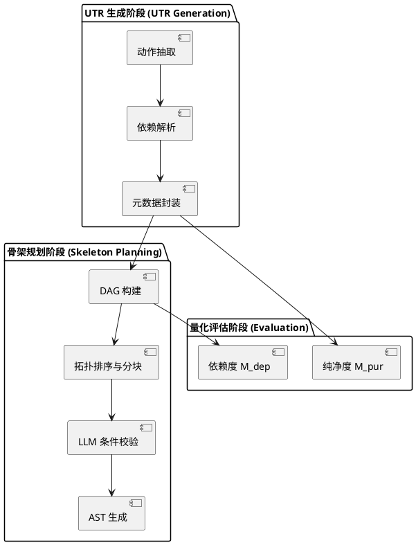

# 统一任务表示 (UTR) 与工作流骨架规划系统

本项目旨在将用户的自然语言任务描述，通过分析和提取转化为**统一任务表示 (UTR)**，并以此为基础自动生成**工作流骨架 (Skeleton)**。系统遵循模块化、职责分离和数据持久化的原则进行设计。

## 架构设计

系统核心架构分为三大主要模块：

1. **UTR 生成模块 (`src/utr_generation`)**
   负责解析用户的自然语言需求，仅提取与后续流程相关的**基础元数据**（不涉及复杂的控制流逻辑）。
   核心类：`UTRGenerator`
   - 解析任务目标
   - 提取核心动作 (`core_actions`)
   - 提取涉及的关键资源和变量 (`core_resources`, `core_variables`)
   - 分析自然语言中的潜在依赖关系 (`implicit_dependencies`)

2. **骨架规划模块 (`src/skeleton_planning`)**
   根据 UTR 模块提供的基础元数据，通过拓扑排序和逻辑分析构建出实际的**执行骨架 (Skeleton Tree)**。
   核心类：`SkeletonPlanner`
   - 接收 `UTR` 对象作为输入
   - 依据 `implicit_dependencies` 构建依赖图
   - 生成由顺序 (`Sequential`) 和并行 (`Parallel`) 块组成的树状工作流结构

3. **通用核心模块 (`src/core`)**
   提供全局共享的数据结构、配置管理和基础工具。
   - `schema.py`: 定义所有模块交互的 Pydantic 数据模型 (如 `UTR`, `Action`, `Block` 等)
   - `llm_client.py`: 大模型 API 客户端
   - `utils.py`: 数据持久化、JSON 格式化等通用函数

## 核心数据流设计 (Schema)

为保证模块职责清晰，避免 UTR 抢占骨架规划的职责，UTR 数据结构设计为仅包含参考性元数据的轻量级载体：

```python
class UTRMetadata(BaseModel):
    task_goal: str 
    core_actions: list[Action] 
    core_resources: list[Resource] 
    core_variables: list[Variable] 
    implicit_dependencies: list[dict[str, str]] # 形如: [{"from": "act_1", "to": "act_2", "reason": "..."}]

class UTR(BaseModel):
    task_id: str 
    task_desc: str 
    metadata: UTRMetadata 
    create_time: str 
```

## 数据持久化规范

为支持测试及多阶段流程的历史数据复用，所有生成的数据必须持久化至 `generated_data/` 目录中，格式为 `JSONL` (JSON Lines)，每行代表一个完整记录。

- **UTR 数据存储**: `generated_data/utr_generation/utrs.jsonl`
- **骨架数据存储**: `generated_data/skeleton_planning/iter<N>/skeletons.jsonl`

### 核心流程图



## 二、 快速使用指南

### 1. 生成 UTR

使用 `scripts/01_generate_utrs.py` 从数据集中随机抽取任务生成 UTR，并保存至持久化目录：

```bash
python scripts/01_generate_utrs.py
```

### 2. 生成骨架规划

使用 `scripts/02_test_skeleton_planner.py` 读取上一步生成的 UTR 数据，进行骨架构建：

```bash
python scripts/02_test_skeleton_planner.py
```

### 3. **运行测试用例**

```bash
python -m pytest tests/
```

## 改进反思与未来规划

- **功能边界明确**：重构后的 UTR 仅作为需求分析的结果输出，不再承担构建条件分支、循环等控制逻辑的任务。这些任务交由专门的骨架规划模块处理，使得模块职责更加单一。
- **大模型辅助校验 (LLM-Assisted Validation)**：为解决全程使用大模型生成导致的“黑盒”问题和创新度不足，骨架规划模块采用了**“算法主导 + 大模型辅助”**的架构。首先由算法（拓扑排序）基于 `implicit_dependencies` 构建出确定性的基础骨架，随后调用大模型作为“校验者”，基于任务描述敏锐捕捉“批量”、“如果”等关键词，向骨架中注入缺失的复杂控制流（如 Conditional 分支和 Loop 循环）。这既保证了生成结果的可控性，又兼顾了对自然语言复杂逻辑的理解能力。
- **扩展性**：未来骨架规划模块可进一步结合规则引擎，形成更加严密的 AST（抽象语法树）校验。
