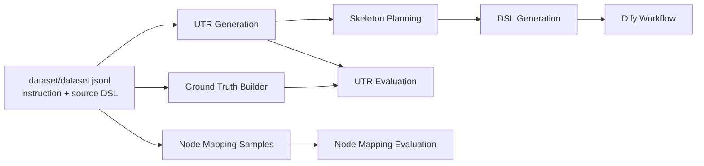

# 架构与链路

本文档定义项目的稳定链路、阶段边界和关键数据产物。

## 总览



项目采用四层职责：

1. `src/core` 定义全局 Schema、配置、LLM 客户端和通用工具。
2. `src/utr_generation` 把自然语言任务抽成统一任务表示 UTR。
3. `src/skeleton_planning` 把 UTR 中的动作和依赖规划成执行骨架。
4. `src/dsl_generation` 把 UTR + Skeleton 编译为 Dify workflow graph。

## 阶段一：UTR Generation

入口：

- `main.py`
- `api.py`
- `scripts/01_generate_utrs.py`
- `src/utr_generation/pipeline.py`

输入：

- 用户自然语言任务文本。
- 批处理时来自 `dataset/dataset.jsonl` 的 `instruction` 字段。

输出：

- `UTR`
- 批处理文件 `generated_data/utr_generation/utrs.jsonl`

职责：

- 提取任务目标 `task_goal`。
- 提取核心动作 `core_actions`。
- 提取资源与变量 `core_resources`、`core_variables`。
- 提取动作之间的潜在依赖 `implicit_dependencies`。

边界：

- UTR 不生成并行、条件、循环等执行控制流。
- UTR 不输出 Dify 节点类型。
- UTR 只作为后续规划和编译的语义输入。

## 阶段二：Skeleton Planning

入口：

- `scripts/02_plan_skeletons.py`
- `src/skeleton_planning/skeleton_planner.py`

输入：

- `UTR`

输出：

- `SequentialBlock` 根节点。
- 批处理文件 `generated_data/skeleton_planning/iter2/skeletons.jsonl`

职责：

- 根据 `implicit_dependencies` 构建有向无环依赖关系。
- 通过拓扑分层生成顺序结构和并行结构。
- 在启用 LLM 时，局部判断动作是否需要条件或循环包装。

边界：

- Skeleton 不决定 Dify 节点类型。
- Skeleton 不写 Dify workflow graph。
- 如果依赖存在环，应明确失败，而不是隐式吞掉错误。

## 阶段三：DSL Generation

入口：

- `scripts/03_compile_dify_workflows.py`
- `src/dsl_generation/pipeline.py`

输入：

- `UTR`
- `SequentialBlock`

输出：

- `DSLCompileOutput`
- Dify workflow payload
- 批处理文件 `generated_data/dsl_generation/dsls.jsonl`

内部步骤：

1. `DSLInputValidator` 校验 UTR 与 Skeleton 的 schema、动作引用、结构合法性。
2. `DSLStructureNormalizer` 生成归一化中间表示，记录上下游、控制域、join 需求。
3. `MinimalDifyWorkflowCompiler` 编译 Dify graph。
4. `NodeMapper` 为业务动作选择 Dify 节点类型。
5. `DifyWorkflowValidator` 校验生成结果是否满足项目内 Dify 约束。

当前第三阶段已经补齐的数据链路规则：

- 业务节点输入不再统一从 `start` 读取，而是按 Skeleton 归一化后的上游槽位解析 `value_selector`。
- 普通顺序链路优先绑定上游业务节点输出，例如 `node_act_1.summary_text -> node_act_2.summary_text`。
- 如果输入名同时存在于 start 变量和上游动作输出，优先绑定上游动作输出，保证改写、清洗、翻译后的数据能继续向下游流动。
- 如果输入名是独立 start 变量，而上游没有匹配输出，则保持读取 start 变量，避免误绑到无关的上游单输出。
- 条件、并行、循环等控制流会生成 join 节点；控制流之后的动作和 end 节点从 join 输出读取。
- 如果 Skeleton 中声明的输入无法从上游输出或 start 变量解析，编译器会退回到真实存在的 start 变量或 `sys.query`，避免生成悬空 selector。
- 条件分支出边使用 Dify 风格的 `case_id` 和 `false` 作为 `sourceHandle`；普通顺序出边仍使用 `source`。
- 循环块会编译为外层 `iteration` 容器、内部 `iteration-start` 起点、循环体节点和 `loop_join`；循环体首步优先读取 `iteration_x.item`，而不是重复读取原始 start 变量。
- 循环体节点和循环体内部边必须带 `isInIteration` 与 `iteration_id`，iteration 容器通过 `output_selector` 指向循环体末端输出，循环之后的 join 再读取 `iteration_x.output`。
- HTTP、tool、parameter-extractor、variable-aggregator 等节点的数据结构已按外部 Dify 样本对齐到更接近可导入形态。

边界：

- DSL 模块可以产生 Dify 特定字段。
- DSL 模块不得修改 UTR 或 Skeleton 的语义定义。
- 节点类型映射必须保留 trace、confidence、degraded 信息，便于评测和排查。

## 评测链路

UTR 评测：

- `scripts/04_build_utr_ground_truth.py`
- `scripts/05_evaluate_utrs.py`

节点映射评测：

- `scripts/07_prepare_node_mapping_eval_data.py`
- `scripts/08_evaluate_node_mapping_generalization.py`
- `scripts/09_prepare_external_node_mapping_eval_data.py`
- `scripts/10_evaluate_external_node_mapping.py`
- `scripts/11_prepare_dify_external_node_mapping_eval_data.py`
- `scripts/12_evaluate_dify_external_node_mapping.py`

外部 Dify 数据集：

- `scripts/13_build_dify_external_dataset.py`
- `scripts/14_prepare_dify_external_eval_from_dataset.py`
- `scripts/15_analyze_dify_external_dataset.py`

## 核心数据产物

```text
generated_data/utr_generation/utrs.jsonl
generated_data/utr_generation/utr_ground_truth.jsonl
generated_data/skeleton_planning/iter2/skeletons.jsonl
generated_data/dsl_generation/dsls.jsonl
generated_data/dsl_generation/node_mapping_eval/
generated_data/dsl_generation/dify_external_node_mapping_eval/
generated_data/dify_external_dataset/
```

`generated_data/` 下的文件是可复现实验产物。稳定结论应沉淀为文档，临时实验结果不应进入 `docs/` 根目录。
